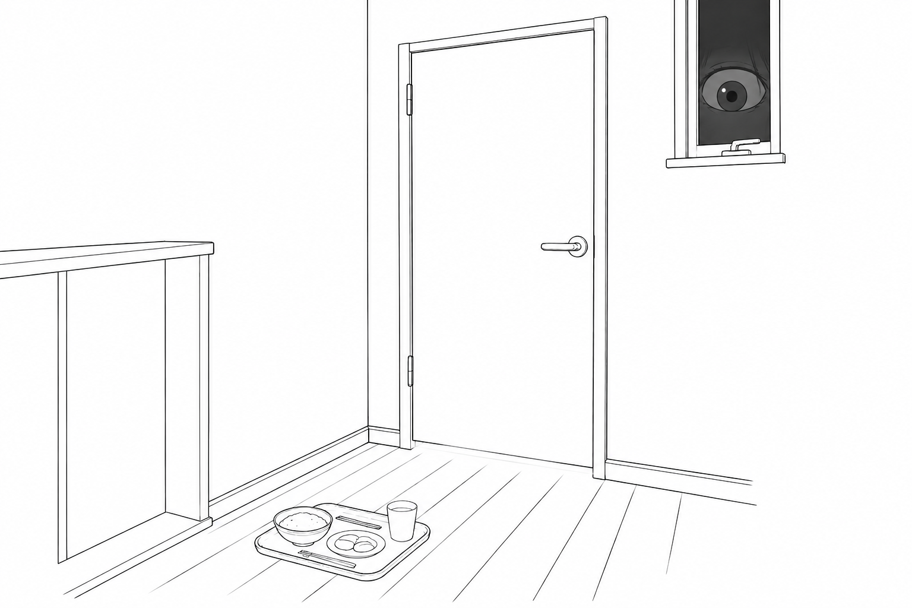

  <strong>エピソード5 「誰かが私をのぞいている」</strong>

 

**優花**、18歳女性。高校3年生。

幼少期の優花は、寡黙で手のかからない子どもだった。
一人でいることを好み、いつも少し離れたところから周囲をじっと眺めていた。その様子はまるで、部屋の片隅に置かれたフランス人形であった。

優花の父親は、厳格かつ几帳面な性格で、地元で診療所を開く開業医だった。
自然科学のみが真の学問だと固く信じて、文学や芸術を暇人の道楽だと蔑んでいた。
家のなかでは父の言葉が絶対であり、母親は専業主婦として家事に専念し、何事も夫の言いなりだった。
そんな父親だったが、優花が幼ない時分は一人娘を猫のように可愛いがった。

中学にあがるころには、優花は真面目で大人しい性格に育っていた。
定期試験ではいつも上位の成績をおさめ、父はそれを当然のことのように受けとめていた。

高校は、地元の進学校に入学した。
そのころ優花は、道行く男性がみな振りかえるような美少女に成長しつつあった。
だが、その顔にはいつも、年ごろの娘らしからぬ憂いの影がさしていた。
というのも、学年があがるにつれて、優花の成績は見る見るうちに下降したのだった。
模試での成績が落ちるたびに、父の機嫌は目に見えて悪くなっていった。
夕食の席ではきまって優花の成績や生活態度が父の口にのぼり、優花はうつむいて食事も喉に通らなかった。

ある日の下校途中、優花は「見知らぬ男に待ち伏せされた」と青ざめた顔で帰宅した。
それ以来、外出するたびに「誰かに見られているかも知れない」という落ちつかない不安に襲われるようになった。
はじめのうちは「気のせいだ」と自分に言い聞かせていた。

春になって、優花は高校3年生に進級した。
受験勉強のストレスは日ごとに重くなり、そこに「国立大学の医学部に行け」という父からの強いプレッシャーが加わった。

夏が過ぎ秋の深まりとともに、優花の不安ははっきりとした形をとりはじめた。
「自分の部屋に盗聴器が仕掛けられている」「街じゅうに監視カメラが張りめぐらされている」と、優花は本気で信じこむようになった。
テレビをつければ、朝のNHKニュースでアナウンサーが自分のことを噂していた。
一人で部屋にいても、沢山の人間で「お前はダメだ」などと優花を非難する声がコーラスのように響いてくる。
頭のなかで考えたことがそのまま声になって響き、周囲の人にも筒抜けになっている――優花はそう怯えるようになった。

冬が来ると優花は、自分の部屋の窓をカーテンで覆い、さらにその上から段ボールで隙間なく目張りした。
ついには部屋から一歩も出なくなり、食事も、母がドアの前に置いたものを、誰もいなくなってから取りこむだけになった。
父が部屋の前で何度呼びかけても、ドアの向こうからは「ブツブツ」と優花の低い独り言だけがとぎれとぎれに聞こえるだけだった。

  

ある冬の寒い夜のことだった。
業を煮やした父が「早く出てこい」と部屋のドアを激しく叩いた。
次の瞬間、優花の叫び声が凍てつく夜空を真っ二つに切り裂いた。

「誰か助けてーー、殺されるーー」

